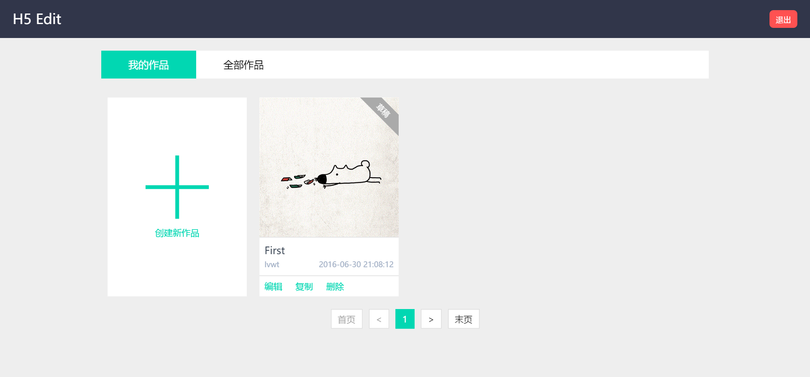
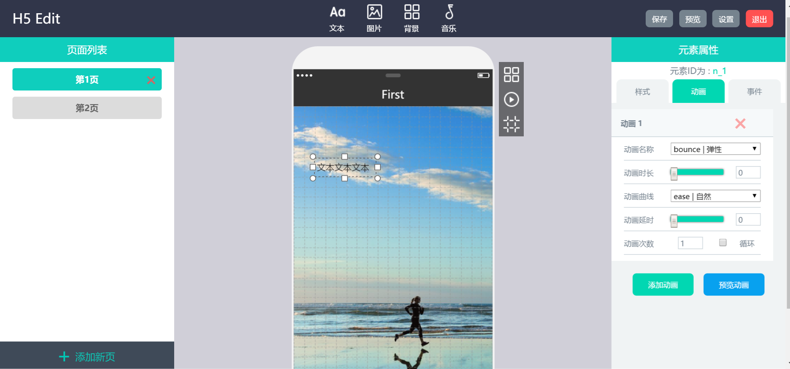
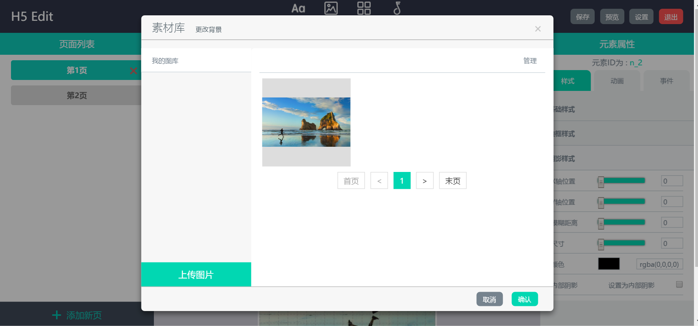

# H5Edit
利用Vue.js和Express开发的一个可视化HTML5页面编辑工具







Getting Started
---------------

* #### 安装本项目依赖包

	```
	npm install
	```

* #### 启动本地MongoDB服务

	> 在本地启动MongoDB服务，并且新建一个名为 `h5edit` 的数据库

	```
	// 本机
	mongod --dbpath ~/data/db
	```

* #### 启动项目

	```
	npm start
	```

* #### 查看效果

	浏览器打开 `localhost:3000` 就可以看到效果啦